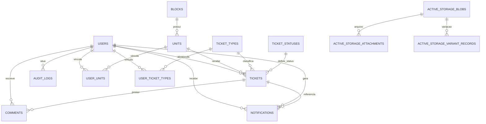

# 🏢 Desafio Dunnas — Sistema de Gestão de Chamados Condominiais

Sistema web para gestão de chamados em ambiente condominial, com controle de acesso por perfil, fluxo operacional com SLA, auditoria e rastreabilidade de ações.

---

## 📚 Sumário

- [1. Visão geral](#1-visão-geral)
  - [1.1 Objetivo da solução](#11-objetivo-da-solução)
  - [1.2 Perfis e responsabilidades](#12-perfis-e-responsabilidades)
  - [1.3 Funcionalidades principais](#13-funcionalidades-principais)
  - [1.4 Anexos de fotos em chamados e comentários](#14-anexos-de-fotos-em-chamados-e-comentários)
- [2. Processo de desenvolvimento e decisões técnicas](#2-processo-de-desenvolvimento-e-decisões-técnicas)
  - [2.1 Estratégia de construção](#21-estratégia-de-construção)
  - [2.2 Decisões técnicas e trade-offs](#22-decisões-técnicas-e-trade-offs)
- [3. Arquitetura e estrutura do projeto](#3-arquitetura-e-estrutura-do-projeto)
- [4. Controle de acesso e regras de autorização (CanCanCan)](#4-controle-de-acesso-e-regras-de-autorização-cancancan)
  - [4.1 Snippet do `Ability`](#41-snippet-do-ability)
  - [4.2 Regras por perfil](#42-regras-por-perfil)
- [5. Regras de negócio críticas](#5-regras-de-negócio-críticas)
  - [5.1 Fluxo de status](#51-fluxo-de-status)
  - [5.2 Reabertura de chamados](#52-reabertura-de-chamados)
  - [5.3 SLA por tipo de chamado](#53-sla-por-tipo-de-chamado)
  - [5.4 Escopo operacional do colaborador](#54-escopo-operacional-do-colaborador)
- [6. Stack, gems e documentações oficiais](#6-stack-gems-e-documentações-oficiais)
  - [6.1 Stack principal](#61-stack-principal)
  - [6.2 Gems e links de documentação](#62-gems-e-links-de-documentação)
- [7. Modelagem de banco de dados](#7-modelagem-de-banco-de-dados)
  - [7.1 Visão conceitual da modelagem](#71-visão-conceitual-da-modelagem)
  - [7.2 Entidades principais](#72-entidades-principais)
  - [7.3 Tabelas de vínculo (N:N)](#73-tabelas-de-vínculo-nn)
  - [7.4 Normalização (1FN, 2FN, 3FN)](#74-normalização-1fn-2fn-3fn)
- [8. Diagrama relacional (ERD)](#8-diagrama-relacional-erd)
- [9. Rotas principais](#9-rotas-principais)
- [10. Como executar o projeto](#10-como-executar-o-projeto)
  - [10.1 Pré-requisitos](#101-pré-requisitos)
  - [10.2 Variáveis de ambiente](#102-variáveis-de-ambiente)
  - [10.3 Execução local sem Docker](#103-execução-local-sem-docker)
  - [10.4 Execução com Docker (desenvolvimento)](#104-execução-com-docker-desenvolvimento)
  - [10.5 Execução com Docker (produção)](#105-execução-com-docker-produção)
  - [10.6 Arquivos Docker e seus papéis](#106-arquivos-docker-e-seus-papéis)
  - [10.7 Migrações e seeds](#107-migrações-e-seeds)
  - [10.8 Credenciais iniciais](#108-credenciais-iniciais)
- [11. Armazenamento de anexos](#11-armazenamento-de-anexos)
- [12. Testes](#12-testes)
  - [12.1 O que os testes cobrem](#121-o-que-os-testes-cobrem)
  - [12.2 Como executar os testes](#122-como-executar-os-testes)
- [13. Informações complementares relevantes](#13-informações-complementares-relevantes)
- [14. Contribuições](#14-contribuições)
- [15. Imagens do projeto](#15-imagens-do-projeto)
  - [15.1 Galeria pública](#151-galeria-pública)
- [16. Licença](#16-licença)

---

## 1. Visão geral

### 1.1 Objetivo da solução

A aplicação foi desenvolvida para cobrir o ciclo completo de atendimento de chamados condominiais:

- abertura e acompanhamento de chamados;
- controle de status com validação de transição;
- comentários e anexos de imagem;
- notificação de eventos importantes;
- acompanhamento de SLA por tipo de chamado;
- trilha de auditoria para ações sensíveis.

### 1.2 Perfis e responsabilidades

O sistema trabalha com três papéis de negócio:

- **Morador (`resident`)**: abre chamados e interage apenas no escopo das unidades vinculadas;
- **Colaborador (`collaborator`)**: atua nos chamados de tipos atribuídos pelo administrador;
- **Administrador (`administrator`)**: possui gestão completa do sistema, incluindo catálogos, vínculos e auditoria.

### 1.3 Funcionalidades principais

- gestão de chamados (criação, listagem, atualização de status, detalhamento);
- comentários por perfil autorizado;
- anexos via Active Storage;
- notificações (`comment_added`, `status_changed`);
- gestão administrativa de blocos e unidades;
- vínculo morador ↔ unidade (`user_units`);
- vínculo colaborador ↔ tipo de chamado (`user_ticket_types`);
- trilha de auditoria de eventos críticos.

### 1.4 Anexos de fotos em chamados e comentários

O sistema permite anexar imagens em dois pontos do fluxo:

- **ao abrir chamado** (`Ticket`), via campo `attachments`;
- **ao comentar chamado** (`Comment`), via campo `photos`.

Snippets de parâmetros permitidos nos controllers:

```ruby
# app/controllers/tickets_controller.rb
params.require(:ticket).permit(*permitted, attachments: [])
```

```ruby
# app/controllers/comments_controller.rb
params.require(:comment).permit(:body, photos: [])
```

No domínio, o `Ticket` valida tipo e tamanho dos anexos de imagem para manter consistência de upload.

---

## 2. Processo de desenvolvimento e decisões técnicas

### 2.1 Estratégia de construção

A implementação foi organizada em etapas para reduzir risco funcional:

1. **Modelagem do domínio e schema relacional** (entidades centrais + vínculos);
2. **Autenticação/autorização** para separar claramente o escopo de cada perfil;
3. **Fluxo de chamados** com validações de status e exceções operacionais;
4. **SLA, notificações e auditoria** para rastreabilidade e governança;
5. **Ambiente dockerizado** para consistência de execução local e produção.

### 2.2 Decisões técnicas e trade-offs

- **Rails + PostgreSQL** para alto nível de produtividade com base relacional robusta.
- **CanCanCan** para centralizar autorização no domínio e evitar regra espalhada.
- **Catálogos (`ticket_types` e `ticket_statuses`)** para flexibilidade sem hardcode de regra.
- **Active Storage local** para persistência dos anexos em disco/volume Docker, alinhado ao escopo final do projeto.
- **Reabertura restrita a admin**: aumenta controle operacional e rastreabilidade.
- **Tabela dedicada de auditoria (`audit_logs`)**: separa rastreabilidade de dados de negócio.

---

## 3. Arquitetura e estrutura do projeto

O projeto foi construído no padrão **MVC (Model-View-Controller)** do Rails:

- **Model**: concentra regras de negócio, validações e relacionamentos;
- **View**: renderiza interface e resposta visual para o usuário;
- **Controller**: orquestra requisições HTTP, autorização, fluxo e respostas.

```txt
app/
  controllers/   # endpoints e fluxo HTTP
  models/        # entidades e regras de negócio
  services/      # serviços de auditoria/notificação
  views/         # páginas e componentes da interface

config/
  routes.rb      # mapa de rotas da aplicação

db/
  migrate/       # histórico de migrações
  schema.rb      # estrutura consolidada do banco

spec/            # suíte principal (RSpec)
test/            # suíte nativa Rails (Minitest)
```

Essa organização reforça o MVC e separa domínio, transporte (HTTP), visualização e automação de testes.

---

## 4. Controle de acesso e regras de autorização (CanCanCan)

### 4.1 Snippet do `Ability`

Trecho representativo da autorização centralizada:

```ruby
class Ability
  include CanCan::Ability

  def initialize(user)
    return unless user

    if user.administrator?
      can :manage, :all
      return
    end

    if user.collaborator?
      can :read, TicketType
      can :read, TicketStatus
      can [ :read, :update ], Ticket, ticket_type_id: user.assigned_ticket_type_ids
      can [ :read, :create ], Comment, ticket: { ticket_type_id: user.assigned_ticket_type_ids }
      return
    end

    can :read, Unit, id: user.unit_ids
    can :read, TicketType
    can :read, Ticket, unit_id: user.unit_ids
    can :create, Ticket, user_id: user.id
    can [ :read, :create ], Comment, ticket: { unit_id: user.unit_ids }
  end
end
```

### 4.2 Regras por perfil

- **Administrador**: acesso total para gerência do sistema.
- **Colaborador**: acesso apenas aos chamados de tipos atribuídos.
- **Morador**: acesso somente às unidades/chamados vinculados ao seu escopo.

A estratégia reduz risco de acesso indevido e simplifica manutenção de permissões.

---

## 5. Regras de negócio críticas

### 5.1 Fluxo de status

Fluxo operacional padrão:

- `Aberto` → `Em andamento` → `Concluído`
- `Concluído` → `Reaberto` (somente administrador)
- `Reaberto` retorna ao fluxo operacional até nova conclusão

### 5.2 Reabertura de chamados

A reabertura é tratada como exceção controlada:

- permitida apenas para administrador;
- exige justificativa (`reopen_reason`);
- registra comentário automático de reabertura;
- limpa resolução anterior e reinicia o ciclo de SLA.

### 5.3 SLA por tipo de chamado

Cada `TicketType` possui `sla_hours`. Os tickets armazenam:

- `sla_started_at`
- `sla_due_at`
- `sla_breached_at`
- `sla_cycle`

Estados funcionais de SLA:

- `on_time`
- `at_risk`
- `breached`
- `no_sla`

### 5.4 Escopo operacional do colaborador

O escopo do colaborador é definido por relação N:N (`user_ticket_types`), não por campo textual no ticket. Isso garante flexibilidade e evita redundância.

---

## 6. Stack, gems e documentações oficiais

### 6.1 Stack principal

- **Ruby 3.2.2**
- **Rails 7.2.3.1**
- **PostgreSQL**
- **Tailwind CSS**
- **Hotwire (Turbo + Stimulus)**
- **Active Storage**
- **Docker / Docker Compose**

### 6.2 Gems e links de documentação

| Gem | Papel no projeto | Documentação |
| --- | --- | --- |
| `devise` | autenticação de usuários | <https://github.com/heartcombo/devise> |
| `cancancan` | autorização por habilidade/perfil | <https://github.com/CanCanCommunity/cancancan> |
| `rails-i18n` | internacionalização | <https://github.com/svenfuchs/rails-i18n> |
| `rspec-rails` | suíte principal de testes | <https://github.com/rspec/rspec-rails> |
| `factory_bot_rails` | factories para testes | <https://github.com/thoughtbot/factory_bot_rails> |
| `shoulda-matchers` | matchers de validação/associação | <https://github.com/thoughtbot/shoulda-matchers> |
| `tailwindcss-rails` | integração Tailwind com Rails | <https://github.com/rails/tailwindcss-rails> |
| `turbo-rails` | navegação reativa | <https://github.com/hotwired/turbo-rails> |
| `stimulus-rails` | comportamento JS com Stimulus | <https://github.com/hotwired/stimulus-rails> |
| `image_processing` | processamento de imagens/anexos | <https://github.com/janko/image_processing> |
| `pg` | driver PostgreSQL | <https://github.com/ged/ruby-pg> |

---

## 7. Modelagem de banco de dados

### 7.1 Visão conceitual da modelagem

A modelagem foi desenhada para separar contextos de forma clara:

- **estrutura física**: blocos e unidades;
- **identidade e acesso**: usuários e papéis;
- **núcleo de atendimento**: tickets, tipos, status, comentários;
- **comunicação**: notificações;
- **governança**: auditoria;
- **anexos**: Active Storage.

### 7.2 Entidades principais

- `users`: identidade, autenticação e papel de acesso.
- `blocks`: configuração estrutural (andares e apartamentos por andar).
- `units`: unidades geradas automaticamente por bloco.
- `ticket_types`: catálogo de tipo com SLA.
- `ticket_statuses`: catálogo de status com flags de default/final.
- `tickets`: entidade central do ciclo de chamados.
- `comments`: histórico de interação por ticket.
- `notifications`: avisos de mudança para usuários.
- `audit_logs`: trilha técnica de eventos críticos.

### 7.3 Tabelas de vínculo (N:N)

- `user_units`: moradores vinculados a unidades.
- `user_ticket_types`: colaboradores vinculados a tipos de chamado.

Essas tabelas evitam duplicação de dados e tornam o escopo por perfil configurável.

### 7.4 Normalização (1FN, 2FN, 3FN)

A normalização é um conjunto de regras formais para organizar dados em tabelas e reduzir inconsistência.
No projeto, ela foi usada para evitar duplicidade, facilitar manutenção e manter integridade do domínio.

#### 1FN — Primeira Forma Normal

A 1FN exige:

1. cada coluna com **valor atômico** (um valor por célula, sem listas);
2. ausência de grupos repetidos na mesma linha;
3. estrutura tabular regular (linhas e colunas bem definidas).

Exemplo prático no projeto:

- em vez de guardar várias unidades em um único campo de `users`, existe a tabela `user_units`;
- anexos/comentários/notificações estão em tabelas próprias, e não “embutidos” em texto.

Por que isso é importante:

- consultas ficam mais simples;
- evita parsing de texto para extrair múltiplos valores;
- melhora consistência da informação.

#### 2FN — Segunda Forma Normal

A 2FN exige que:

1. a tabela já esteja na 1FN;
2. todo atributo não-chave dependa da **chave completa** (e não apenas de parte dela).

Esse ponto é mais crítico em tabelas de associação (chaves compostas lógicas), como:

- `user_units` (usuário ↔ unidade);
- `user_ticket_types` (usuário ↔ tipo de chamado).

No projeto, essas tabelas guardam apenas os dados da própria relação, evitando colunas que dependam só de `user_id` ou só de `unit_id`/`ticket_type_id`.

Por que isso é importante:

- impede anomalias de atualização;
- evita repetir informações em múltiplas linhas de vínculo;
- mantém o relacionamento limpo e estável.

#### 3FN — Terceira Forma Normal

A 3FN exige que:

1. a tabela esteja na 2FN;
2. atributos não-chave **não dependam de outros atributos não-chave** (sem dependência transitiva).

Exemplo de aplicação no projeto:

- dados de status ficam em `ticket_statuses`, não replicados em cada ticket como texto livre;
- tipos e SLA ficam em `ticket_types`, reduzindo repetição no histórico de chamados;
- auditoria (`audit_logs`) e notificações (`notifications`) têm tabelas próprias.

Por que isso é importante:

- reduz redundância e risco de divergência;
- facilita evolução de regra sem refatorar dados duplicados;
- melhora legibilidade do modelo relacional.

Resumo: a aplicação de 1FN + 2FN + 3FN neste projeto contribui para um banco mais consistente, com melhor governança de dados e menor acoplamento entre contextos do domínio.

---

## 8. Diagrama relacional (ERD)

> Espaço para inclusão/atualização do diagrama relacional oficial do projeto (imagem ou Mermaid).

### Versão Mermaid (atual)



---

## 9. Rotas principais

- `resources :tickets` (com `resources :comments, only: [:create]` aninhado)
- `resources :ticket_statuses`
- `resources :ticket_types`
- `resources :blocks`
- `resources :notifications` com ação `mark_all_as_read`
- `devise_for :users` com controller de sessão customizado
- namespace `admin`:
  - `users`
  - `user_units`
  - `audit_logs`
  - `units#index`

Raiz da aplicação:

- autenticado → `tickets#index`
- não autenticado → `users/sessions#new`

---

## 10. Como executar o projeto

### 10.1 Pré-requisitos

- Docker e Docker Compose para execução containerizada; **ou**
- Ruby + Bundler + PostgreSQL para execução local.

### 10.2 Variáveis de ambiente

#### Desenvolvimento

1. Copie `.env.example` para `.env`.
2. Defina ao menos:
   - `RAILS_ENV`
   - `SECRET_KEY_BASE`
   - `POSTGRES_HOST`, `POSTGRES_USER`, `POSTGRES_PASSWORD`, `POSTGRES_DB`
   - `ADMIN_EMAIL`, `ADMIN_PASSWORD`

#### Produção

No padrão atual do projeto, a configuração de produção é feita via bloco `environment` no `docker-compose.prod.yml` (sem dependência de `env_file`).

Você pode fornecer essas variáveis de duas formas:

1. **Direto no ambiente do shell/CI/CD** (padrão recomendado para servidor/pipeline);
2. **Carregando de arquivo `.env.production` manualmente** antes de subir os serviços (apenas como conveniência operacional).

Em ambos os casos, defina ao menos:
   - `APP_IMAGE`, `APP_PORT`
   - `RAILS_MASTER_KEY`, `SECRET_KEY_BASE`
   - `ACTIVE_STORAGE_SERVICE`
   - `POSTGRES_HOST`, `POSTGRES_DB`, `POSTGRES_USER`, `POSTGRES_PASSWORD`
   - `ADMIN_EMAIL`, `ADMIN_PASSWORD`

### 10.3 Execução local sem Docker

```bash
bundle install
bin/rails db:prepare
bin/rails db:seed
bin/dev
```

### 10.4 Execução com Docker (desenvolvimento)

```bash
docker compose up --build
```

O serviço web executa: `db:prepare`, `db:seed` e `bin/dev`.

### 10.5 Execução com Docker (produção)

```bash
docker build -t desafio_dunnas:prod .
docker compose -f docker-compose.prod.yml up -d
```

### 10.6 Arquivos Docker e seus papéis

O projeto possui arquivos separados para ambientes diferentes para manter clareza e previsibilidade operacional.

#### `Dockerfile.dev` (desenvolvimento)

Objetivo: imagem de trabalho local, focada em produtividade e ciclo rápido de desenvolvimento.

```dockerfile
FROM ruby:3.2.2-slim
RUN apt-get update -qq && \
    apt-get install --no-install-recommends -y build-essential git libpq-dev libvips postgresql-client
WORKDIR /rails
```

Por que existe:

- inclui dependências úteis no dia a dia de desenvolvimento;
- combina com bind mount do código local e comando `bin/dev`.

#### `Dockerfile` (produção)

Objetivo: imagem final otimizada para deploy.

```dockerfile
FROM docker.io/library/ruby:$RUBY_VERSION-slim AS base
FROM base AS build
RUN bundle install
RUN SECRET_KEY_BASE_DUMMY=1 ./bin/rails assets:precompile
FROM base
COPY --from=build /rails /rails
ENTRYPOINT ["/rails/bin/docker-entrypoint"]
CMD ["./bin/rails", "server"]
```

Por que existe:

- usa **multi-stage build** para reduzir artefatos desnecessários na imagem final;
- compila assets no build;
- executa com entrypoint de preparo do banco e runtime enxuto.

#### `docker-compose.yml` (desenvolvimento)

Objetivo: subir ambiente local completo (`web` + `db`) com código montado e comandos de bootstrap.

```yaml
services:
  db:
    image: postgres:16-alpine
  web:
    build:
      dockerfile: Dockerfile.dev
    command: bash -c "... ./bin/rails db:prepare && ./bin/rails db:seed && ./bin/dev"
```

#### `docker-compose.prod.yml` (produção)

Objetivo: orquestrar execução com imagem pronta (`APP_IMAGE`), healthcheck e volume persistente.

```yaml
services:
  db:
    environment:
      POSTGRES_USER: ${POSTGRES_USER:?POSTGRES_USER is required}
      POSTGRES_PASSWORD: ${POSTGRES_PASSWORD:?POSTGRES_PASSWORD is required}
      POSTGRES_DB: ${POSTGRES_DB:?POSTGRES_DB is required}
  web:
    image: ${APP_IMAGE:?APP_IMAGE is required}
    environment:
      POSTGRES_DB: ${POSTGRES_DB:?POSTGRES_DB is required}
      POSTGRES_USER: ${POSTGRES_USER:?POSTGRES_USER is required}
      POSTGRES_PASSWORD: ${POSTGRES_PASSWORD:?POSTGRES_PASSWORD is required}
      RAILS_MASTER_KEY: ${RAILS_MASTER_KEY:?RAILS_MASTER_KEY is required}
      SECRET_KEY_BASE: ${SECRET_KEY_BASE:?SECRET_KEY_BASE is required}
    volumes:
      - app_storage:/rails/storage
```

No formato atual, o compose de produção usa variáveis obrigatórias no `environment` com validação `${VAR:?mensagem}`.

##### Forma 1 — Rodar produção via environment (sem arquivo obrigatório)

Basta exportar as variáveis no shell (ou injetar no CI/CD) e executar o compose:

Exemplo (shell do servidor ou etapa CI):

```bash
export APP_IMAGE=seu_usuario/desafio_dunnas:1.0.1
export APP_PORT=3000
export RAILS_MASTER_KEY=...
export SECRET_KEY_BASE=...
export ACTIVE_STORAGE_SERVICE=local
export POSTGRES_HOST=db
export POSTGRES_DB=desafio_dunnas_production
export POSTGRES_USER=postgres
export POSTGRES_PASSWORD=...
export ADMIN_EMAIL=admin@seucondominio.com
export ADMIN_PASSWORD=...

docker compose -f docker-compose.prod.yml up -d
```

##### Forma 2 — Carregar variáveis de um arquivo `.env.production` (opcional)

Mesmo sem `env_file` no compose, você pode usar um arquivo para facilitar operação manual:

```bash
set -a
source .env.production
set +a
docker compose -f docker-compose.prod.yml up -d
```

Ou, se preferir, usar:

```bash
docker compose --env-file .env.production -f docker-compose.prod.yml up -d
```

Motivo de existirem dois compose:

- `docker-compose.yml`: otimizado para desenvolvimento iterativo;
- `docker-compose.prod.yml`: otimizado para execução de produção com imagem publicada e variáveis de produção.

### 10.7 Migrações e seeds

- preparar/criar banco e migrar: `bin/rails db:prepare`
- aplicar migrações manualmente: `bin/rails db:migrate`
- popular dados iniciais: `bin/rails db:seed`

### 10.8 Credenciais iniciais

O `db/seeds.rb` cria um administrador se não houver nenhum no sistema:

- email: `ADMIN_EMAIL`
- senha: `ADMIN_PASSWORD`

Fallback (somente se variáveis não forem definidas):

- `admin@admin.com`
- `123456`

> Recomendação: sempre definir credenciais seguras para ambiente real.

---

## 11. Armazenamento de anexos

O projeto utiliza Active Storage com serviço local no estado atual:

- `test` → `tmp/storage`
- `local` → `storage`

Em produção, `docker-compose.prod.yml` monta volume persistente em `/rails/storage`.

---

## 12. Testes

### 12.1 O que os testes cobrem

A suíte de testes cobre os fluxos críticos do sistema.

#### RSpec (`spec/`) — suíte principal

- **Models**
  - permissões no `Ability` por perfil;
  - regras de fluxo do `Ticket` (status default, bloqueios de escopo, reabertura e nota de conclusão);
  - unicidade de status padrão;
  - regra do último administrador;
  - vínculo usuário-unidade.
- **Requests**
  - criação de chamados por escopo;
  - bloqueio de ações fora do escopo;
  - comentários por perfil autorizado;
  - upload de foto em comentários;
  - transição/reabertura de status com validação de perfil;
  - catálogo administrativo (`ticket_types`, `ticket_statuses`);
  - blocos e geração automática de unidades;
  - vínculos administrativos (`user_units`);
  - auditoria de autenticação e auditoria administrativa com filtros.

#### Minitest (`test/`) — suíte nativa Rails

- controllers, models e system tests básicos da aplicação Rails;
- mantém compatibilidade com a estrutura padrão do framework.

### 12.2 Como executar os testes

Preparação:

```bash
bundle install
bin/rails db:prepare
```

RSpec (principal):

```bash
bundle exec rspec
bundle exec rspec spec/models
bundle exec rspec spec/requests
```

Minitest (Rails):

```bash
bin/rails test
bin/rails test test/controllers
bin/rails test test/system
```

---

## 13. Informações complementares relevantes

- O projeto possui `Dockerfile.dev` (desenvolvimento) e `Dockerfile` multi-stage (produção).
- Há proteção no domínio para impedir rebaixamento do último administrador.
- A geração de unidades é automática ao criar bloco (`after_create`).
- A auditoria possui contexto técnico (`request_id`, `ip_address`, `user_agent`, `change_set`).

---

## 14. Contribuições

Mesmo sendo um projeto concluído para processo seletivo, melhorias de documentação e correções pontuais podem ser organizadas da seguinte forma:

1. crie uma branch a partir de `develop`;
2. faça commits pequenos e objetivos;
3. valide localmente os comandos principais (`bin/rails db:prepare`, testes aplicáveis);
4. abra PR com descrição clara do problema e da solução.

Boas práticas para contribuições:

- manter consistência de nomenclatura e estilo já adotados no projeto;
- evitar mudanças amplas sem necessidade;
- documentar alterações de comportamento no `README.md`.

---

## 15. Imagens do projeto

Esta seção apresenta evidências visuais da aplicação para leitura pública do repositório.

### 15.1 Galeria pública

| Imagem | Link |
|---|---|
| [](https://drive.google.com/file/d/1DJ-2ILS-HpK-HbaMkfjTXBAl_z5MMS0I/view?usp=sharing) | [Visualizar](https://drive.google.com/file/d/1DJ-2ILS-HpK-HbaMkfjTXBAl_z5MMS0I/view?usp=sharing) |
| [](https://drive.google.com/file/d/ID_LISTAGEM/view?usp=sharing) | [Visualizar](https://drive.google.com/file/d/ID_LISTAGEM/view?usp=sharing) |
| [](https://drive.google.com/file/d/ID_DETALHE/view?usp=sharing) | [Visualizar](https://drive.google.com/file/d/ID_DETALHE/view?usp=sharing) |
| [](https://drive.google.com/file/d/ID_ABERTURA/view?usp=sharing) | [Visualizar](https://drive.google.com/file/d/ID_ABERTURA/view?usp=sharing) |
| [](https://drive.google.com/file/d/ID_COMENTARIO/view?usp=sharing) | [Visualizar](https://drive.google.com/file/d/ID_COMENTARIO/view?usp=sharing) |
| [](https://drive.google.com/file/d/ID_NOTIFICACOES/view?usp=sharing) | [Visualizar](https://drive.google.com/file/d/ID_NOTIFICACOES/view?usp=sharing) |
| [](https://drive.google.com/file/d/ID_BLOCOS/view?usp=sharing) | [Visualizar](https://drive.google.com/file/d/ID_BLOCOS/view?usp=sharing) |
| [](https://drive.google.com/file/d/ID_VINCULOS/view?usp=sharing) | [Visualizar](https://drive.google.com/file/d/ID_VINCULOS/view?usp=sharing) |
| [](https://drive.google.com/file/d/ID_TIPOS/view?usp=sharing) | [Visualizar](https://drive.google.com/file/d/ID_TIPOS/view?usp=sharing) |
| [](https://drive.google.com/file/d/ID_STATUS/view?usp=sharing) | [Visualizar](https://drive.google.com/file/d/ID_STATUS/view?usp=sharing) |
| [](https://drive.google.com/file/d/ID_AUDITORIA_LISTA/view?usp=sharing) | [Visualizar](https://drive.google.com/file/d/ID_AUDITORIA_LISTA/view?usp=sharing) |
| [](https://drive.google.com/file/d/ID_AUDITORIA_DETALHE/view?usp=sharing) | [Visualizar](https://drive.google.com/file/d/ID_AUDITORIA_DETALHE/view?usp=sharing) |

---

## 16. Licença

Este repositório inclui o arquivo `MIT LICENSE`, indicando distribuição sob a licença MIT.

---

Desenvolvido como solução para o desafio técnico da Dunnas, com foco em regras de negócio, segurança de acesso e rastreabilidade operacional.